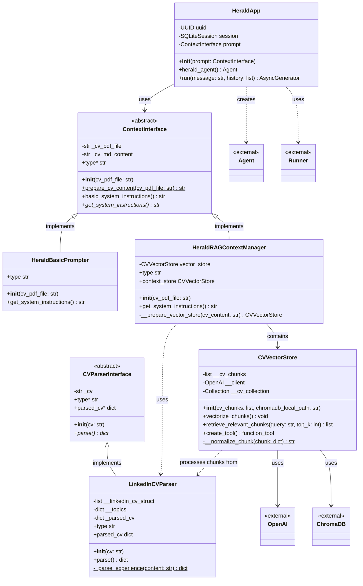

# 🎺 Herald

[](https://github.com/vijaykv1/herald/actions/workflows/pylint.yml)
[](https://github.com/vijaykv1/herald/actions/workflows/tests.yml)

**Herald** is an intelligent AI-powered chatbot that acts as your personal representative, answering questions about your 
professional background, skills, and experience based on your CV or LinkedIn profile.

## 🌟 Features

- **Dual Interface Support**: Choose between browser-based (Gradio) or terminal-based UI
- **Multiple Context Strategies**:
  - **Basic Prompt**: Direct CV content injection into the system prompt
  - **RAG-based**: Retrieval-Augmented Generation using vector embeddings for more accurate, context-aware responses
- **LinkedIn CV Parser**: Specialized parser for LinkedIn-generated CVs with intelligent section extraction
- **First-Person Responses**: The bot speaks as you, providing natural conversational experiences
- **Conversation History**: Maintains session context using SQLite for coherent multi-turn conversations
- **Trace Management**: Built-in tracing for debugging and monitoring LLM interactions

## 🏗️ Architecture

### Class Diagram

The following diagram shows the core classes and their relationships in the Herald system:



### Interaction Flow

The following activity diagram illustrates how Herald processes user queries from start to finish:

```mermaid
flowchart TD
    Start([User Starts Herald]) --> LoadEnv[Load Environment Variables]
    LoadEnv --> CheckUI{WITH_BROWSER?}
    
    CheckUI -->|yes| BrowserUI[Launch Gradio UI]
    CheckUI -->|no| TerminalUI[Launch Terminal UI]
    
    BrowserUI --> SelectPrompt{PROMPT_OPTION?}
    TerminalUI --> SelectPrompt
    
    SelectPrompt -->|basic| BasicPrompt[Create HeraldBasicPrompter]
    SelectPrompt -->|rag| RAGPrompt[Create HeraldRAGContextManager]
    
    BasicPrompt --> LoadCV[Load CV from PDF]
    RAGPrompt --> LoadCV
    
    LoadCV --> ConvertCV[Convert PDF to Markdown<br/>using pymupdf4llm]
    
    ConvertCV --> PrepareContext{Context Type?}
    
    PrepareContext -->|basic| InjectCV[Inject Full CV<br/>into System Prompt]
    PrepareContext -->|rag| ParseCV[Parse CV with<br/>LinkedInCVParser]
    
    ParseCV --> ChunkCV[Split CV into<br/>Semantic Chunks]
    ChunkCV --> Vectorize[Create Embeddings<br/>with OpenAI API]
    Vectorize --> StoreVector[Store in ChromaDB<br/>Vector Database]
    
    InjectCV --> CreateApp[Create HeraldApp Instance]
    StoreVector --> CreateApp
    
    CreateApp --> WaitQuery[Wait for User Query]
    
    WaitQuery --> ProcessQuery{Query Received}
    
    ProcessQuery -->|exit/quit| Cleanup
    ProcessQuery -->|question| CreateSession[Create/Reuse<br/>SQLite Session]
    
    CreateSession --> CreateTrace[Generate Trace ID]
    CreateTrace --> CheckContextType{Context Type?}
    
    CheckContextType -->|basic| CreateAgent1[Create Agent with<br/>Full CV Context]
    CheckContextType -->|rag| CreateAgent2[Create Agent with<br/>Retrieval Tool]
    
    CreateAgent1 --> RunAgent[Run Agent via Runner]
    CreateAgent2 --> RAGRetrieval{Agent needs info?}
    
    RAGRetrieval --> QueryVector[Query Vector Store<br/>with Semantic Search]
    QueryVector --> RetrieveChunks[Retrieve Top-K<br/>Relevant Chunks]
    RetrieveChunks --> ProvideContext[Provide Context<br/>to Agent]
    ProvideContext --> RunAgent
    
    RunAgent --> StreamResponse[Stream Response<br/>to User]
    StreamResponse --> DisplayAnswer[Display Answer]
    
    DisplayAnswer --> WaitQuery
    
    Cleanup[Cleanup Trace Database] --> End([Application Ends])
    
    style Start fill:#90EE90
    style End fill:#FFB6C1
    style CreateAgent1 fill:#87CEEB
    style CreateAgent2 fill:#87CEEB
    style RAGRetrieval fill:#FFD700
    style QueryVector fill:#FFD700
    style InjectCV fill:#DDA0DD
    style ParseCV fill:#DDA0DD
```



## 📋 Prerequisites

- Python >= 3.12
- OpenAI API key
- PDF CV file (or markdown/text format)

## 🚀 Installation

1. Clone the repository:
```bash
git clone https://github.com/vijaykv1/herald.git
cd herald
```

2. Install dependencies using [uv](https://github.com/astral-sh/uv) (recommended) or pip:
```bash
# Using uv (recommended)
uv venv
uv sync

# Or using pip
pip install -e .
```

## ⚙️ Configuration

Create a `.env` file in the project root with the following variables:

```env
# Required: Path to your CV (PDF format)
CV_PATH=/path/to/your/cv.pdf

# Required: Your OpenAI API key
OPENAI_API_KEY=your_openai_api_key_here

# Optional: Your name (used in prompts)
ME=Your Name

# Optional: UI mode - "yes" for browser, "no" for terminal (default: "no")
WITH_BROWSER=no

# Optional: Context strategy - "basic" or "rag" (default: "basic")
PROMPT_OPTION=basic
```

## 🎯 Usage

### Terminal Mode (Default)

```bash
python main.py
```

This launches an interactive terminal interface where you can ask questions about the CV:

```
🎺 The Herald
Ask questions about the CV (type 'exit' to quit)

Query: What is your experience with Python?
Answer: I have worked with Python for...
```

### Browser Mode (Gradio)

Set `WITH_BROWSER=yes` in your `.env` file, then run:

```bash
python main.py
```

This launches a web interface accessible at `http://localhost:7860` (or another port shown in the terminal).

## 🧠 Context Strategies

### Basic Prompt (`PROMPT_OPTION=basic`)

- Injects the entire CV content directly into the system prompt
- Simple and fast
- Best for smaller CVs
- No additional setup required

### RAG-based (`PROMPT_OPTION=rag`)

- Uses vector embeddings and semantic search
- Retrieves only relevant CV sections for each query
- Better for larger CVs
- More accurate for specific queries
- Automatically creates a local ChromaDB vector store

## 🛠️ Development

### Running Tests

The project includes a comprehensive test suite with unit and integration tests. Tests use mocking extensively to avoid external dependencies.

```bash
# Using uv (recommended)
uv pip install -e ".[dev]"
uv run pytest

# Run with coverage report
uv run pytest --cov=herald --cov-report=term-missing

# Run specific test file
uv run pytest tests/test_app.py -v

# Run with different verbosity
uv run pytest -vv

# Using pip
pip install -e ".[dev]"
pytest
```

### Test Structure

- **tests/conftest.py**: Shared fixtures and test configuration
- **tests/test_cv_parser.py**: Tests for CV parsing modules
- **tests/test_context_manager.py**: Tests for context management strategies
- **tests/test_rag.py**: Tests for RAG vector store
- **tests/test_app.py**: Tests for main application logic
- **tests/test_main.py**: Tests for entry point and CLI
- **tests/test_integration.py**: End-to-end integration tests

### Code Quality

The project uses Pylint for code quality checks:

```bash
# Using uv
uv run pylint $(git ls-files '*.py')

# Using pip
pylint $(git ls-files '*.py')
```

Configuration can be found in `pyproject.toml`:
- Max line length: 120 characters
- Disabled checks: `fixme`

### Project Structure

- **`main.py`**: Entry point for the application
- **`herald/app.py`**: Core application logic and agent setup
- **`herald/cv_parser/`**: CV parsing implementations
  - LinkedIn CV parser with section extraction
  - Experience parsing with job details
- **`herald/context_manager/`**: Different context strategies
  - Basic prompt-based context
  - RAG-based context with vector retrieval
  - Vector store using ChromaDB and OpenAI embeddings

## 📦 Dependencies

Key dependencies include:

- **openai-agents**: For building the conversational agent
- **gradio**: Browser-based UI
- **chromadb**: Vector database for RAG
- **pymupdf4llm**: PDF to markdown conversion
- **langchain-text-splitters**: Text chunking for RAG
- **rich**: Beautiful terminal output
- **pydantic**: Data validation

See `pyproject.toml` for the complete list.

## 🤝 Contributing

Contributions are welcome! Please feel free to submit a Pull Request.

1. Fork the repository
2. Create your feature branch (`git checkout -b feature/amazing-feature`)
3. Commit your changes (`git commit -m 'Add some amazing feature'`)
4. Push to the branch (`git push origin feature/amazing-feature`)
5. Open a Pull Request

## 📄 License

This project is licensed under the terms specified in the [LICENSE](LICENSE) file.

## 🙏 Acknowledgments

- Built with [OpenAI Agents](https://github.com/openai/openai-agents-python)
- UI powered by [Gradio](https://gradio.app/)
- Vector storage with [ChromaDB](https://www.trychroma.com/)

## 📞 Support

For issues, questions, or contributions, please open an issue on the [GitHub repository](https://github.com/vijaykv1/herald).

---

Made with ❤️ by the Herald team
